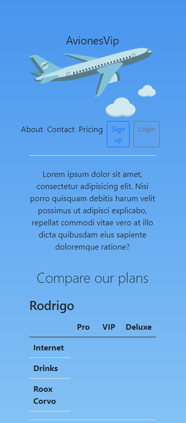

# AvionesVip 🛩️
Program for scheduling flights and see information about them.

----------

## Technologies 
This project is designed for learning to develop with NodeJs, MongoDB and Jade(PUG) templates among other technologies.

## Frontend 👀🎨
- PUG Templates (Jade).
- Bootstrap5
- Sweetalert2

## Backend 💻💾
- NodeJs
- MongoDB

## Others ❓
- (To update).

### Node Modules
- express
- cookie-parser
- dotenv
- mongodb
- morgan
- path
- express-session
- http-errors
- http

```bash
npm install express cookie-parser dotenv mongodb morgan path express-session http-errors http
```

----------

## Preview
#### Index preview.
----------



